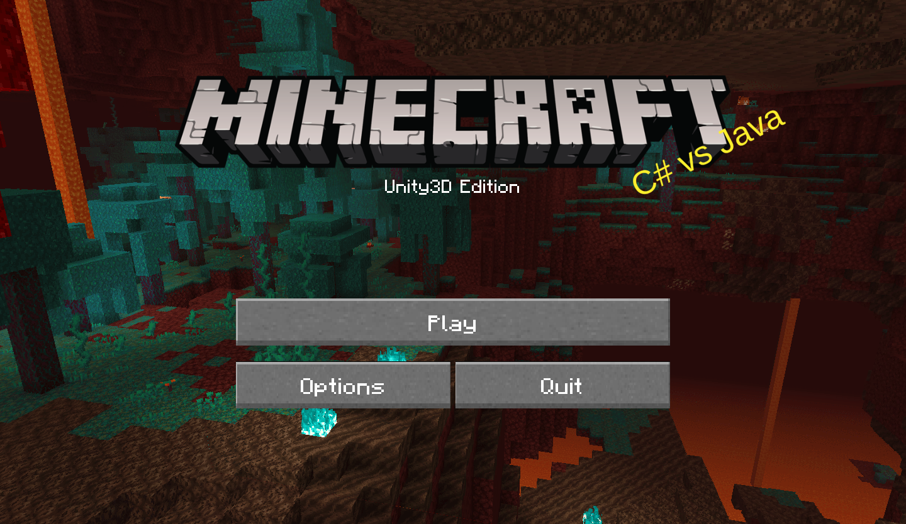
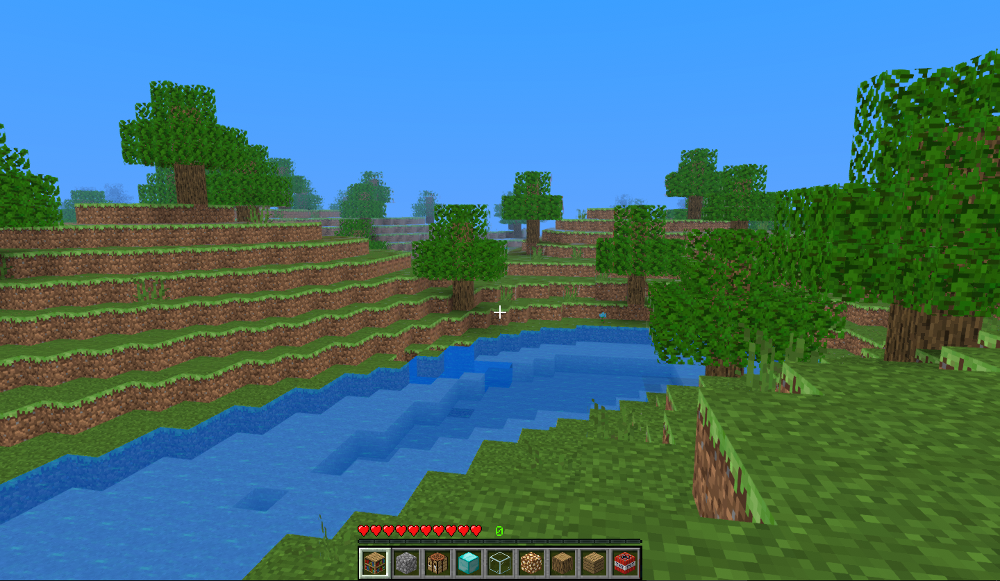
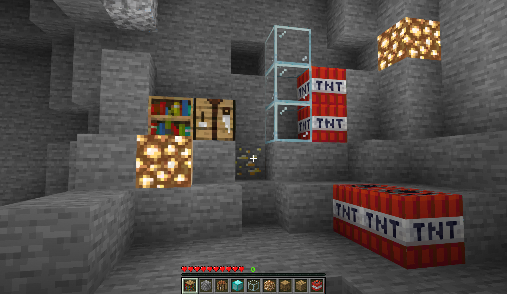
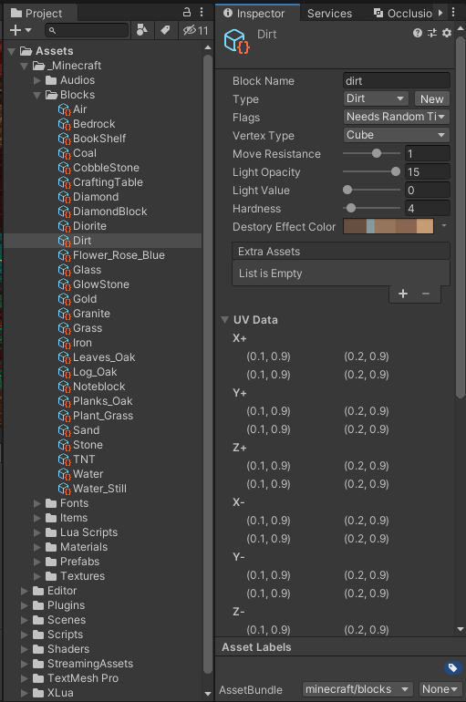
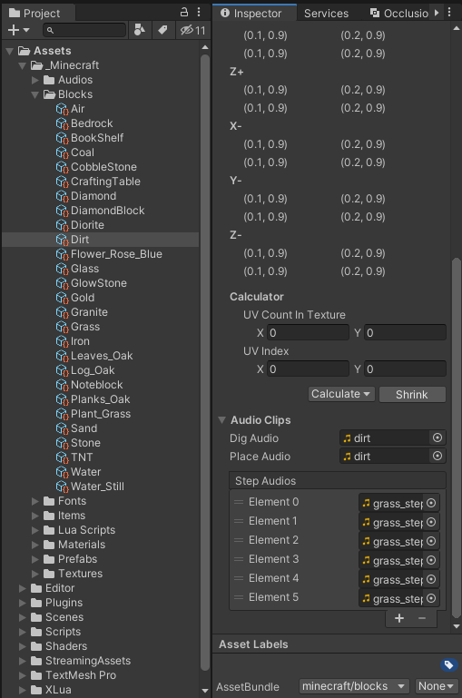
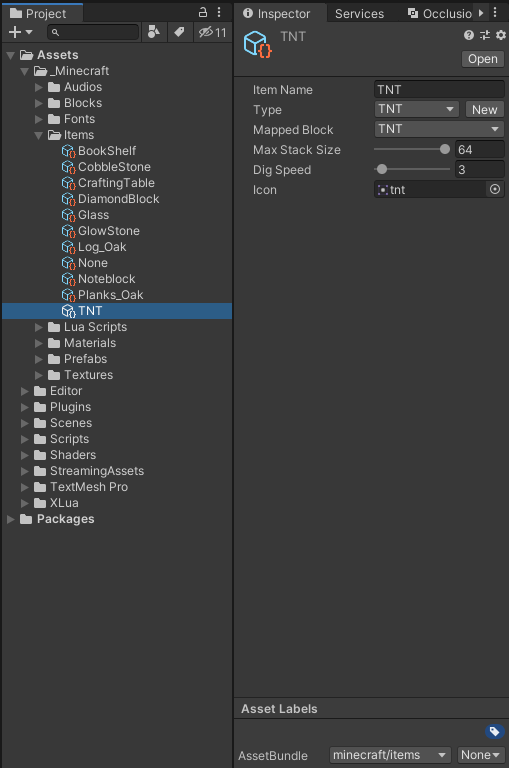

# A Minecraft clone made with Unity

This is a fork of [this repo, by Jin Yuhan](https://github.com/Jin-Yuhan/MinecraftClone-Unity).
I plan to replace Minecraft copyrighted assets, and add my own twist to it.
For now, it remains a pretty great copy of Minecraft!

## Features

* Infinite chunk generation
* Caves and Ores
* Lighting And Physics
* TNT Explosion
* Flowing water
* Sand affected by gravity
* Saves world to files
* Audios and Particle effects
* Custom resource packages
* Some bugs (〃'▽'〃)

## Block Editor and Item Editor in Unity

You can create a new block or item without writing any code! Some complex block logic only needs to be written using C# scripts.

(Sorry, Jin Yuhan. The LUA caused more problems than it solved for me.)

## References

**In no particular order**

1. [TrueCraft](https://github.com/ddevault/TrueCraft)
2. [MineClone-Unity](https://github.com/bodhid/MineClone-Unity)
3. [MinecraftClone](https://github.com/Shedelbower/MinecraftClone)
4. [Making a Minecraft Clone](https://www.shedelbower.dev/projects/minecraft_clone/)
5. [Minecraft_Wiki](https://minecraft-zh.gamepedia.com/Minecraft_Wiki)
6. [炒鸡嗨客协管徐的CSDN博客](https://blog.csdn.net/xfgryujk)
